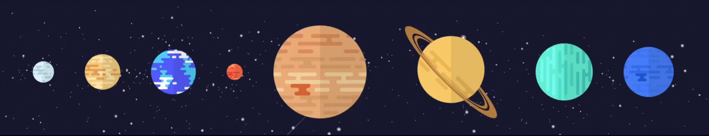
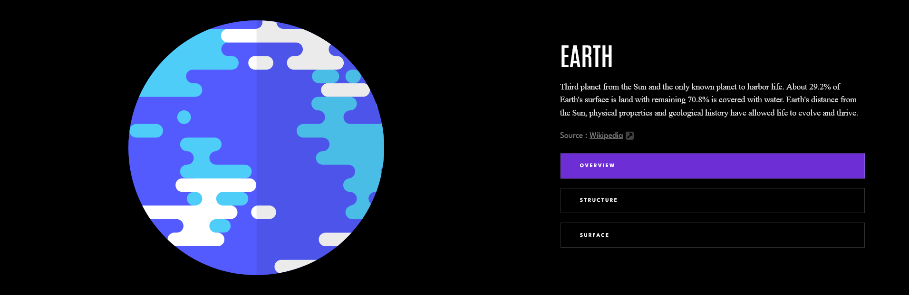
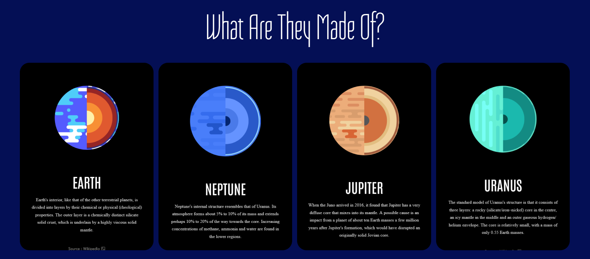

## Learn about our planets

Discover fascinating facts about the planets in our solar system with PlanetoidFactoids! Explore everything from Earth to the giant planets like Jupiter and learn cool, unique details about our cosmic neighbors.

## Chose what planet you want to visit.

Chose the planet you want to visit by clicking on it on our homepage. Get taken to the facts page about the planet you wanna learn more about.

### See all the info you need about it.

Did you know that even though Jupiter is the largest planet in our solar system, it's only about 1/1,047th the mass of the Sun? Also, Earth is located in the 'Goldilocks Zone,' the optimal distance from the Sun where conditions are just right for liquid water and life.

Find out more interesting facts about the rest of the planets in our solar system!

### Learn interesting stats about each planet. 

Find out which planet has the coldest average temperature or the longest revolution time. The average temperature on Mars can be similar to some of the coldest nights on Earth, particularly in places like Antarctica or the coldest regions of the Northern Hemisphere during winter time.

### Learn about the structure of each planet, see what they are made of.

Each planet has its own unique characteristics, but they are broadly classified into two groups: rocky planets and gas giants. Find out how the rocky planets differ from the gas giants.

## Built with:

- React.js
- styled-components
- react-router-dom
- Vite

