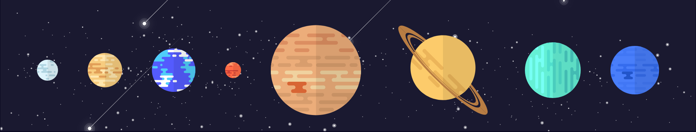

# PlanetoidFactoids

## Learn about our planets

Learn cool and interesting facts about the planets in our solar system. Take a trip to our cosmic neighbors, 
from our planet Earth to the giants such as Jupiter. PlanetoidFactoids shows you all kinds of interesting facts about our planets.

## Chose what planet you want to visit.

Chose the planet you want to visit by clicking on it on our homepage.

### See all the info you need about it.

### Learn interesting facts about the planet, like it's radius and average temperature

## Learn what planets are made of. 

